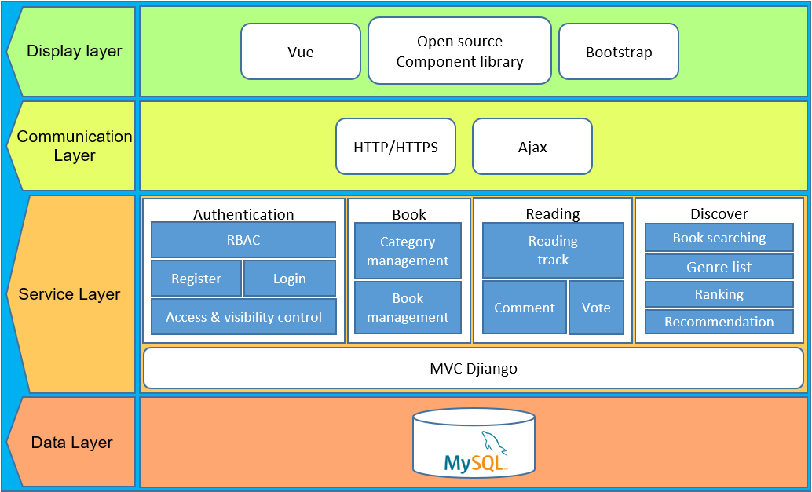
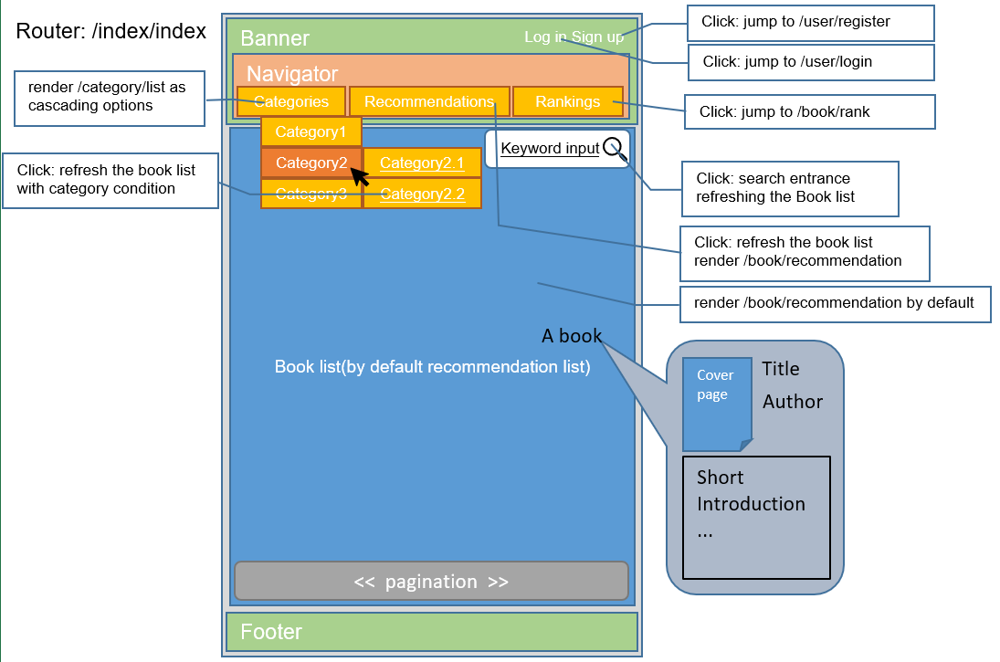
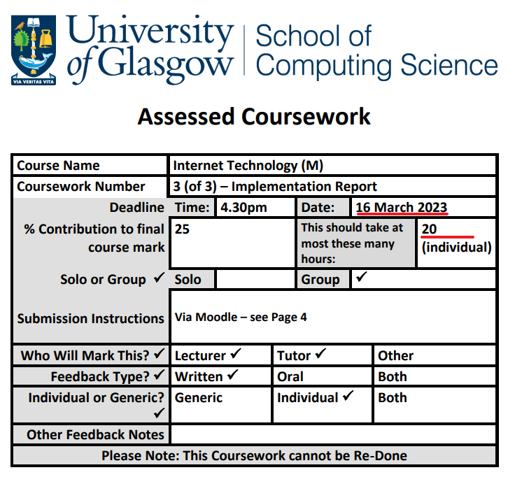
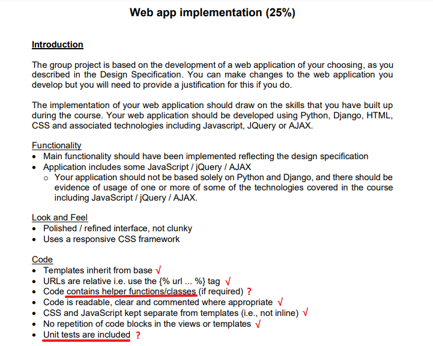
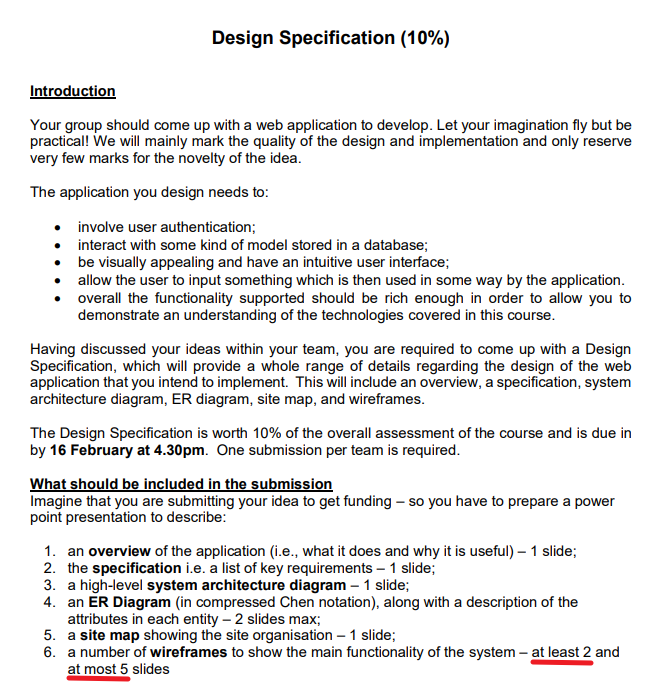

# Athenaneum
Project using Django

# ATHENAEUM

## Functionalities

### Summary

- Index

- Role-based auth control

  - Super admin (Role id: 0, manually created)
  - Admin (Role id: 1, created by Super admin)
  - User (Role id: 2, register by guests)

- Authority management (Rely on RBAC)

  - Register (involved Role.rid)
  - Login
  - Authority check/judgment in the following routes:
    - Resigter: different visibility for diff roles
    - Index banner: different visibility for diff roles
  - Login check in the following routes:
    - Search
    - Comment
    - Vote

- Category management

  - Create
  - List
  - Delete (involved Cat.catId)
  - Edit (involved Cat.catId)

- Book management (Rely on Category)

  - Create (involved Cat.catId)
  - List
  - Delete (involved Book.bid)
  - Edit (involved Book.bid)

- Reading

  - Create reading record: Follow/track/reading
  - List reading record: Profile/Library

- Ranking

  - Create a vote record: vote a book (involved User.uid & Book.bid, no repeat vote)
  - Ranking: summarizes a ranking according to the vote count.

- Searching

  - Keyword search: select bid from Book where targetFiled = "%$keyword%";
  - Filter search:
    - Category (involved Cat.catId)
    - Language (involved Book.lang)
    - Vote amount (involved Book.bid & Vote)

- Recommendation

  - Recommend randomly
  - Recommend by rank
  - Recommend by reading record (Optional):
    - Recent reading category (involved Reading.lastReadTime)
    - All reading preferences (involved Reading.bid & Book.catId & Cat.catId)

- Comment

  - Create comment
  - Reply comment (Unlimited layer model or Q&A model)
  - Remove comment (involved Comment.cmid)

  

  If there is any omission, please point out as soon as possible.

  

  Potential problems:

  - Can we finish these in time? Which is non-essential?
  - Have we meet the requirements of the customer(assessment)?
  - How can we demonstrate our various skills rather than repeat an ability multiple times?
  - Do we remain Book tags?
  - Do we remain account settings? Allowing user to change email?
  - While adding a book, we need an upload field to upload the cover page of the book, and also the picture will be displayed in the book details page.

  

### System architecture

### Draft APIs

#### Module/Controller list

To divide and conquer the former functionalities, the following **7** controllers need to be build:

- IndexController
- UserController
- CategoryController
- BookController
- RecommendationController
- CommentController

Be aware that in MVC frameworks, the **controller class name** and **action method name** should conventionally ***be consistent with*** the request **route**.

#### IndexController

| Method name | route        | Description                            |
| ----------- | ------------ | -------------------------------------- |
| index       | /index/index | Display the index page of the web app. |

#### UserController

| Method name | route          | Description                                                  | Data dependencies                                            |
| ----------- | -------------- | ------------------------------------------------------------ | ------------------------------------------------------------ |
| register    | /user/register | If the HTTP request type is **get**, display the registration form. if the role is **Super admin**, display an additional **role selection** form element, otherwise, provide the username, password, email, etc. Consider save the role id in cookie as a basis. If the HTTP request type is **post**, insert data into table, creating an account. While finished, redirect to /user/login. | User.uid User.rid User.username User.password User.OthersAsNeeded |
| login       | /user/login    | If the HTTP request type is **get**, display the login form. If the HTTP request type is **post**, means the user submitted p&w, and intends to verify and get access. Receive the data and attempt to match a record in the User table. Once matched, respond a cookie to the browser to save a message(sessionID,rid) to mark/keep the login status. Consider cookie/session in Django. Once finished, redirect to /index/index. | User.username User.password User.sessionID User.rid |

#### CategoryController

| Method name | route            | Description                                                  | Data dependencies                    |
| ----------- | ---------------- | ------------------------------------------------------------ | ------------------------------------ |
| add         | /category/add    | If the HTTP request type is **get**, display the add form. If the HTTP request type is **post**, insert data into table, creating an category.  Maximum 2 level. (parentID=0 top level category, parentID!=0 second level category) While finished, redirect to /category/list. | Cat.catId Cat.name Cat.pid |
| list        | /category/list   | Display all categories.                                      | Cat.catId Cat.name              |
| edit        | /category/edit   | If the HTTP request type is **get**, display the edit form, load current data into form elements via v-model command.  If the HTTP request type is **post**, update data into table.  While finished, redirect to /category/list. | Cat.catId Cat.name Cat.pid |
| delete      | /category/delete | Once clicked, prompt a confirm dialog.  Once confirmed, send the category id to the server, and check the category whether has sub-categories. If so, show a warning message and terminate the deletion. If not, delete the cat by ID.  While finished, redirect to /category/list. | Cat.pid Cat.catId               |

#### BookController

| Method name    | route                | Description                                                  | Data dependencies                                            |
| -------------- | -------------------- | ------------------------------------------------------------ | ------------------------------------------------------------ |
| add            | /book/add            | If the HTTP request type is **get**, display the add form. If the HTTP request type is **post**, insert data into table, creating a book.  The cover page image will be saved in a specific folder on the server, and be named a time-related random **file name** While finished, redirect to /book/list.   | Book.bid Book.title Book.author Book.catIds Book.coverpage Book.intro Book.link Cat.catId |
|                |                      |                                                              |                                                              |
| list           | /book/list           | Display all books.  Render the tracking status according to the tracklist of the current user, which can be gathered via /book/getTrackedIds. Render the voting status according to the votelist of the current user, which can be gathered via /book/getVotedIds. | Book.bid Book.title Book.coverpage                 |
| details        | /book/details        | Display an empty template/view of book details.  Once loaded, request /book/selectBookById asynchronously and render the response data into elements. For cover page image, modify the src attribute to: src=/book/cover/**file name** Besides, request /comment/getCommentByBookId to gather comment data and render as a comment list. |                                                              |
| selectBookById | /book/selectBookById | Select and response the records of a specific book.          | Book.bid Book.title Book.author Book.catIds Book.coverpage Book.link Cat.catId Cat.name |
| cover          | /book/cover          | Response the cover page image by given **file name**.        |                                                              |

| Method name       | route                   | Description                                                  | Data dependencies                                            |
| ----------------- | ----------------------- | ------------------------------------------------------------ | ------------------------------------------------------------ |
| edit              | /book/edit              | If the HTTP request type is **get**, display the edit form, load current data into form elements by v-model command.                                                                                                                                                                                                    If the HTTP request type is **post**, update data into table. While finished, redirect to /category/list.  | Book.bid Book.title Book.author Book.catIds Book.coverpage Book.link |
| delete            | /book/delete            | Once clicked, prompt a confirm dialog. Once confirmed, send the book id to the server, delete the book by ID. | Book.bid                                                     |
| track             | /book/track             | Toggle to insert or remove a record from the Reading list.   | Track.tid User.uid Book.bid                        |
| getTrackedIds     | /book/getTrackedIds     | Response the book ids which were traced by the user to support rendering track toggle botton. | Track.tid User.uid Book.bid                        |
| profile           | /book/profile           | List all recorded books by a specific user id, represents as links. Once clicked, redirect to /book/selectBookById and pass the book id to display the book details. | Track.tid User.uid Book.bid Book.title        |
| vote              | /book/vote              | Toggle to insert or remove a vote record.                    | Vote.vid User.uid Book.bid                         |
| getVotedIds       | /book/getVotedIds       | Response the book ids which were voted by the user to support rendering vote toggle botton. | Vote.vid User.uid Book.bid                         |
| rank              | /book/rank              | Display an empty template/view of book ranking. Once loaded, request /book/getRankByTrack and /book/getRankByVote asynchronously and render the response data into table elements. |                                                              |
| getRankByTrack    | /book/getRankByTrack    | Response the book ranking according to trackings.            | Track.tid Book.bid                                      |
| getRankByVote     | /book/getRankByVote     | Response the book ranking according to votes.                | Vote.vid Book.bid                                       |
| recommendation    | /book/recommendation    | Display an empty template/view of book recommendation. Once loaded, request /book/getRecommendation asynchronously and render the response data into table elements. |                                                              |
| search            | not exist               | Search is actually a conditional book list. The default list is non-condition book list or a book list under a category The front-end organizes the additional keywords and filters as conditions, and the server attempt to search, and renders the result in /book/list | Book.title Book.author Book.catId Cat.name Book.intro |
| getRecommendation | /book/getRecommendation | Response a ramdon/most voted/most tracked recommendation book ArrayList (parse to Json). | Book.bid Book.title Book.author Book.coverpage |

#### CommentController

| Method name         | route                        | Description                                                  | Data dependencies                                            |
| ------------------- | ---------------------------- | ------------------------------------------------------------ | ------------------------------------------------------------ |
| post                | /comment/post                | Having that following the main body of the /book/details, we provide a comment text area and submit botton.  It allows user to post an initial comment or reply to any comment. Warning: Defence XSS attack | Comment.cid Comment.content Comment.bid Comment.postTime Comment.replyToId |
| getCommentsByBookId | /comment/getCommentsByBookId | Response organized comment collection data to support  the /book/details page render a comment list. | Comment.cid Comment.content Comment.bid Comment.postTime Comment.replyToId |

### Route access control

Be aware that the user can manually insert any request URL in the browser, or even make fake requests via curl/wget or other customized programs.

In one word, front-end route control is essential to prevent ordinary users from accidentally entering protected pages; also, back-end verifies are significant as well,  to deny malicious users.

| No.  | routes               | Requirements | Involve role-based check/visibility                          |
| ---- | -------------------- | ------------ | ------------------------------------------------------------ |
| 1    | /index/index         | Guest        | Front end check: different function entrance in the banner (category management, book management) |
| 2    | /user/register       | Guest        | Front end check: different form element (role selection); Back end check: user can not specify role |
| 3    | /user/login          | Guest        |                                                              |
| 4    | /category/add        | Login, admin | Front end check: vue-route bans user request; Back end check: denied user, redirect to /index/index |
| 5    | /category/list       | Guest        | ditto                                                        |
| 6    | /category/edit       | Login, admin | ditto                                                        |
| 7    | /category/delete     | Login, admin | ditto                                                        |
| 8    | /book/add            | Login, admin | ditto                                                        |
| 9    | /book/list           | Guest        |                                                              |
| 10   | /book/details        | Guest        |                                                              |
| 11   | /book/selectBookById | Guest        |                                                              |
| 12   | /book/cover          | Guest        |                                                              |
| 13   | /book/edit           | Login, admin | ditto                                                        |
| 14   | /book/delete         | Login, admin | ditto                                                        |

...continued

| No.  | routes                       | Requirements | Involve role-based check/visibility |
| ---- | ---------------------------- | ------------ | ----------------------------------- |
| 15   | /book/track                  | Login, user  |                                     |
| 16   | /book/getTrackedIds          | Login, user  |                                     |
| 17   | /book/profile                | Login, user  |                                     |
| 18   | /book/vote                   | Login, user  |                                     |
| 19   | /book/getVotedIds            | Login, user  |                                     |
| 20   | /book/rank                   | Login, user  |                                     |
| 21   | /book/getRankByTrack         | Login, user  |                                     |
| 22   | /book/getRankByVote          | Login, user  |                                     |
| 23   | /book/recommendation         | Login, user  |                                     |
| 24   | /book/getRecommendation      | Login, user  |                                     |
| 25   | /comment/post                | Login, user  |                                     |
| 26   | /comment/getCommentsByBookId | Login, user  |                                     |

### Cyber security

Defence SQL injection and XSS attack in every insert function.

### Check point

Up to this point, all functionalities are checked as feasible.

If there is any omission, please feedback as soon as possible.

## Data schema

This chapter aims to summarize tables and attributes to ensure data schema is consistent with functionalities.

### Draft Table definitions

#### User

| Field          | Type        | Key     | Description                                 |
| -------------- | ----------- | ------- | ------------------------------------------- |
| uid            | int         | primary | auto increment user id                      |
| rid            | enum(0,1,2) |         | 0 super admin, 1 admin, 2 user              |
| username       | varchar(32) | unique  |                                             |
| password       | char(32)    |         | md5 or other encrypted password             |
| nickname       | varchar(32) |         |                                             |
| sessionId      | char(32)    |         | session control attribute                   |
| lastActiveTime | timestamp   |         | Supports auto log out function (optional)   |
| lastLoginTime  | timestamp   |         | Supports keep logged in function (optional) |

#### Category

| Field     | Type         | Key     | Description                                                  |
| --------- | ------------ | ------- | ------------------------------------------------------------ |
| catId     | int          | primary | auto increment category id                                   |
| name      | varchar(32)  | unique  |                                                              |
| pid       | int          |         | parent catId, 0 represents this cat is a top level cat, otherwise a secondary cat |
| intro     | varchar(256) |         | intro (optional)                                             |
| coverpage | varchar(64)  |         | filename of the cover page image of the cat (optional)       |

#### Book

| Field     | Type         | Key     | Description                                                  |
| --------- | ------------ | ------- | ------------------------------------------------------------ |
| bid       | int          | primary | auto increment book id                                       |
| title     | varchar(32)  |         |                                                              |
| author    | varchar(32)  |         |                                                              |
| catIds    | varchar(64)  |         | (logical foreign key) Ids of categories of the book, comma separated. Violating 1NF but a common approach. |
| coverpage | varchar(64)  |         | Filename of the cover page image of the book (saved on a fixed server directory) |
| intro     | varchar(256) |         |                                                              |
| link      | varchar(256) |         | External links to purchase/read the book                     |

#### Track

| Field | Type | Key         | Description                    |
| ----- | ---- | ----------- | ------------------------------ |
| tid   | int  | primary     | auto increment track record id |
| uid   | int  | foreign key | refers to User.uid             |
| bid   | int  | foreign key | refers to book.bid             |

#### Vote

| Field | Type | Key         | Description                   |
| ----- | ---- | ----------- | ----------------------------- |
| vid   | int  | primary     | auto increment vote record id |
| uid   | int  | foreign key | refers to User.uid            |
| bid   | int  | foreign key | refers to book.bid            |

#### Comment

| Field    | Type         | Key         | Description                                                  |
| -------- | ------------ | ----------- | ------------------------------------------------------------ |
| cid      | int          | primary     | auto increment comment id                                    |
| bid      | int          | foreign key | refers to book.bid                                           |
| content  | varchar(256) |             |                                                              |
| postTime | timestamp    |             | A sorting basis                                              |
| replyTo  | int          |             | A cascading basis: the id of the comment which this comment replied to |

### Check point

Up to this point, all data schema are sufficient to support functionalities.

All relations are in BCNF except Book is violating 1NF (Book.catIds).

If you have a better design, please feel free to modify.

## Process flow

Functional design must be feasible and consistent, otherwise, the project risk will increase.

We'd better clarify how our front pages organize function entrances (button, link, other interactive elements) to call the backend APIs.

In this chapter, I merely provide my personal, technical perspective design example as a basis for iteration. Please discuss in the teams to ask for clarify.

### Page example

### Page summary

Not all functions correspond to a page. Many functions are just an API to provide data to be rendered. A page can call and render multiple APIs asynchronously. Please consider to avoid or reduce using template engine, they waste performance and outdated.

The following table specify weather a route provides a page:

| No.  | routes               | Response type                                    |
| ---- | -------------------- | ------------------------------------------------ |
| 1    | /index/index         | HTML                                             |
| 2    | /user/register       | HTML form (get) / Json Operation response (post) |
| 3    | /user/login          | HTML form (get) / Json Operation response (post) |
| 4    | /category/add        | HTML form (get) / Json Operation response (post) |
| 5    | /category/list       | HTML                                             |
| 6    | /category/edit       | HTML form (get) / Json Operation response (post) |
| 7    | /category/delete     | Json Operation response                          |
| 8    | /book/add            | HTML form (get) / Json Operation response (post) |
| 9    | /book/list           | HTML                                             |
| 10   | /book/details        | HTML                                             |
| 11   | /book/selectBookById | Json Book data                                   |
| 12   | /book/cover          | Image                                            |
| 13   | /book/edit           | HTML form (get) / Json Operation response (post) |
| 14   | /book/delete         | Json Operation response                          |

...continued

| No.  | routes                       | Response type                                                |
| ---- | ---------------------------- | ------------------------------------------------------------ |
| 15   | /book/track                  | Json Operation response                                      |
| 16   | /book/getTrackedIds          | Json Track data                                              |
| 17   | /book/profile                | HTML                                                         |
| 18   | /book/vote                   | Json Operation response                                      |
| 19   | /book/getVotedIds            | Json Vote data                                               |
| 20   | /book/rank                   | HTML                                                         |
| 21   | /book/getRankByTrack         | Json Rank data                                               |
| 22   | /book/getRankByVote          | Json Rank data                                               |
| 23   | /book/recommendation         | HTML                                                         |
| 24   | /book/getRecommendation      | Json Recommendation data                                     |
| 25   | /comment/post                | Json Operation response (Input elements within /book/details) |
| 26   | /comment/getCommentsByBookId | Json Comment data                                            |

Therefore, there are **13** HTLM pages need to be design.

## Assessment review

1. We have a month, ideally 20h/person to build the app

   

2. Some requirements are vague/out of plan

   

   

   

   

3. Use the space wisely

   
